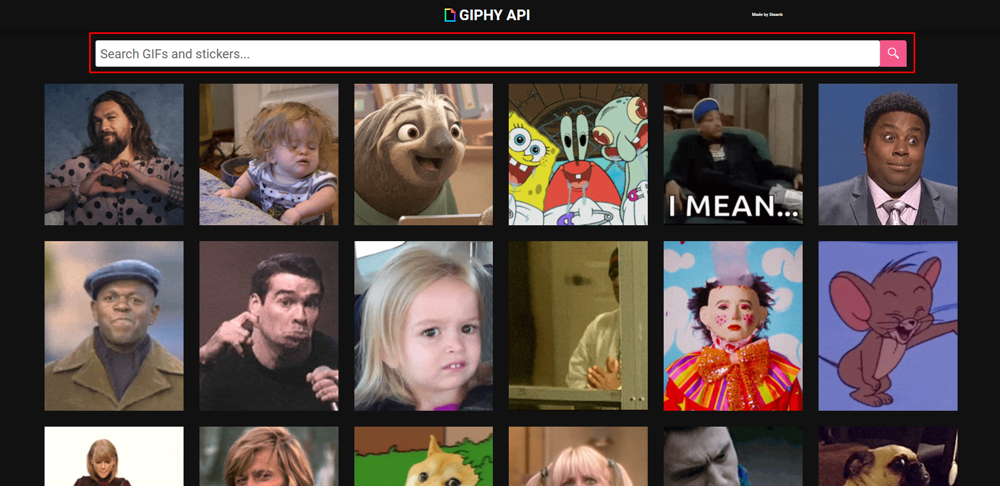
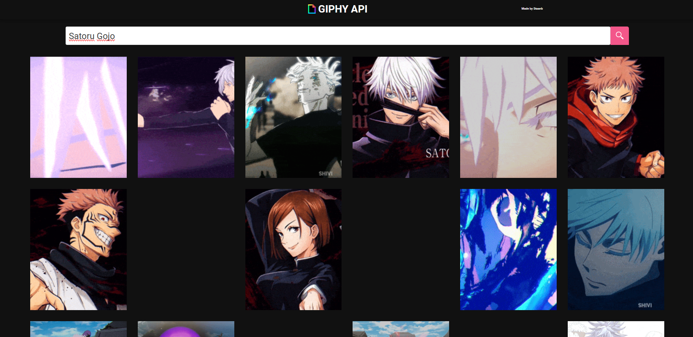
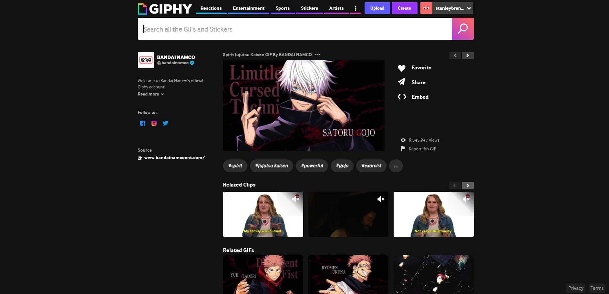

<div align="center">

<h1 align="center">GIPHY API - Search Gifs and stickers 🖼️</h1>

<p align="center">🚀Interface simples feita consumindo a API do GIPHY e filtrando GIFs escolhidos pelo usuário.</p>

<h4 align="center"> 
	✅ GIPHY PROJECT 🖼️ Projeto concluído  ✅
</h4>
</div>

### 🛠️ Instalação
---
Para instalar esse projeto e executar localmente:

1.  Clone o repositório em sua máquina:

    ```sh
    git clone https://github.com/StaanB/giphy-project.git
    ```

2.  Navegue até o diretório do projeto:

    ```sh
    cd giphy-project
    ```

3. Instale as dependências com npm, yarn ou pnpm:

    ```sh
    npm install
    ```

    ```sh
    yarn install
    ```

    ```sh
    pnpm install
    ```

4.  Começe o servidor de desenvolvimento com npm, yarn ou pnpm:

    ```sh
    npm run dev
    ```

    ```sh
    yarn dev
    ```

    ```sh
    pnpm dev
    ```

5.  Abra seu navegador e acesse http://localhost:3000 (ou outro servidor local dependendo da máquina) para acessar o projeto.

<br/>   
<br/>

### ✅ Objetivo
---
<p>💡 O objetivo era apresentar o consumo de APIs simples como o da GIPHY, consumos simples de API são importantes para o desenvolvimento Front-end logo é importante praticar o máximo possível.</p>
<br/>   
<br/> 

### 💻 Tecnologias
---
<h2>Tecnologias que eu usei nesse projeto:</h2>

- **ReactJS** - Framework utilizado para desenvolver a aplciação
- **TypeScript** - Linguagem tipada para compilar javascript.
- **Kendo UI** - Biblioteca de React UI utilizada para fazer os principais componentes do projeto.
- **Jest** - Os testes do projeto foram feitos com JestJS
  
<br/>   
<br/>

### 💡Features
---
- [x] Pesquisar GIFs no site de busca
- [x] Acionar um GIF para ser redirecionado ao site original para baixar ou copiar o link do GIF
- [x] Responsividade para dispositivos móveis  
<br/>   
<br/> 

### 📚 Documentação
---

1. Buscar GIFs
 - Para buscar GIFs basta pesquisar o conteúdo de interesse na barra de pesquisa.
<br/>

 
 
---

2. Após buscar os GIFs serão renderizados
 - Ao começar a digitar na barra de pesquisa os GIFs já serão renderizados 
<br/>

   
 
 
---

3. Ao clicar em um GIF 
 - Ao clicar em um link você será redirecionado para a página do GIPHY para baixar ou copiar o link se desejar
   
 
 
<br/>

---

4. Ver outros projetos!😁
 - Possuo outros projetos com consumo de diversas APIs, uma feita por mim, sinta-se livre para ver!

<br/>
<br/>

<h3><a href="https://github.com/StaanB/holiday-manager/blob/main/LICENSE">⚖️LICENSE</a></h3>

<br/>   
<br/> 

### 🧑🏻Author
---
<a href="https://github.com/StaanB">
 
 <br />
 <sub><b>Stanley Brenner</b></sub></a> <a href="https://stanley-b.vercel.app/" title="Stanley">🚀</a>

Made by Stanley 👋🏽 contact me!

[](https://www.linkedin.com/in/stanley-brenner-front-end/)
[](mailto:stanleybrenner@gmail.com)
